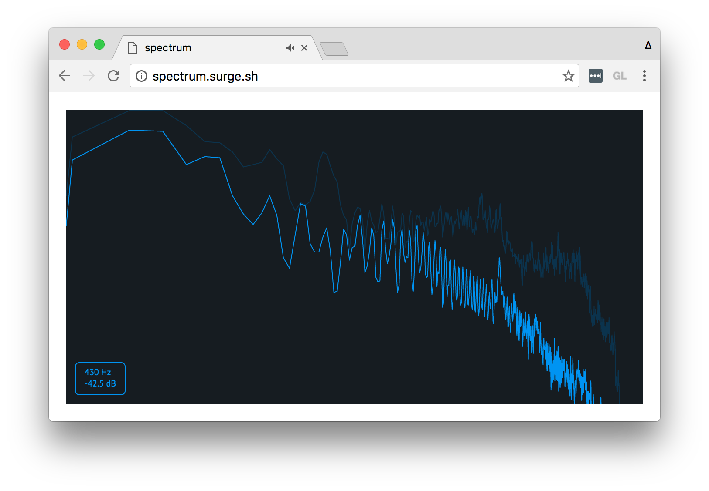

# spectrum

[](http://github.com/badges/stability-badges)

A small web app that shows the frequencies in real-time of a MP3/OGG file. Modelled after Ableton Live's Spectrum effect.

#### [https://spectrum.surge.sh](http://spectrum.surge.sh/)



## Usage

To build from source:

```sh
git clone https://github.com/mattdesl/spectrum.git
cd spectrum
npm install
npm run start
```

## License

MIT, see [LICENSE.md](http://github.com/mattdesl/spectrum/blob/master/LICENSE.md) for details.
